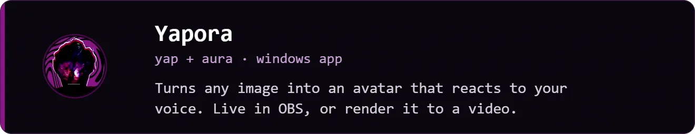

Hi, I'm Wassim, a software engineer from Tunisia. I mostly build things for clients, and sometimes for myself when something bugs me enough.

Things I'm working on:

[wsoltani.com](https://wsoltani.com) · [LinkedIn](https://linkedin.com/in/wsoltani)
