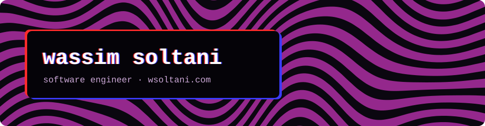

Hi, I'm Wassim, from Tunisia. I'm a senior software engineer at Vantage Labs, and I run [Blueblood](https://blueblood.tech/), where I build my own products when something bugs me enough.

### Things I'm working on

- **[Netherstone](https://netherstone.app/)**, a free desktop app for Windows, macOS and Linux. Keeps your documents, drawings and files in a folder on your computer, synced across your devices and fully offline. ([source](https://github.com/Netherstone-HQ/Netherstone))
- **[Yapora](https://github.com/wSoltani/yapora)**, a Windows app (yap + aura). Turns any image into an avatar that reacts to your voice, live in OBS or rendered to a video.
- **[Syncify](https://github.com/wSoltani/syncify)**, a Spicetify extension. Backs up your Marketplace extensions, themes and snippets, and restores them when Spotify breaks.
- **[Switchflare](https://switchflare.wsoltani.com/)**, a browser extension for switching between Cloudflare accounts in one click. Not out yet.

[wsoltani.com](https://wsoltani.com) · [LinkedIn](https://linkedin.com/in/wsoltani)
